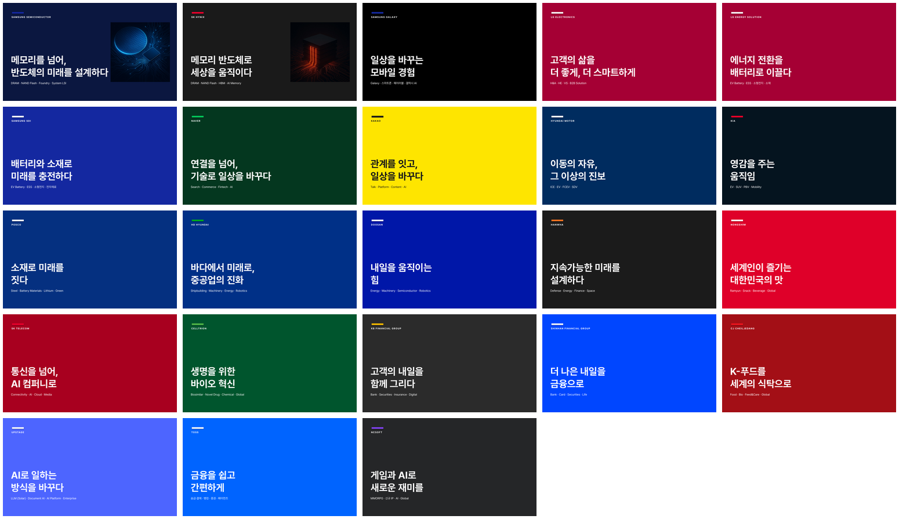

# kr-brand-decks

**한국 주요 23개 기업 브랜드 테마 PPTX 데크 스킬 모음** — Claude Code & Cursor용.
23 Claude Code / Cursor skills that generate polished, on-brand PowerPoint decks
themed after major Korean enterprises. Content is yours; the palette, layout, and
format are owned by code — so every deck comes out clean and consistent.



> ⚠️ **비공식(unofficial) 브랜드 영감 테마입니다.** 어떤 회사와도 제휴·보증 관계가 없으며,
> 상표·로고는 각 소유주의 자산입니다. 본 저장소는 **로고 파일을 포함하지 않고** 공개된 브랜드
> 컬러만 참고합니다. See [LICENSE](LICENSE) · [SECURITY.md](SECURITY.md).

---

## ✨ 무엇인가

- **23개 독립 스킬** — 회사마다 `deck-<company>` 스킬 하나. 검증된 브랜드 컬러 팔레트 + 레퍼런스급 네이티브 레이아웃.
- **레퍼런스급 레이아웃 세트** — 표지·목차·섹션 디바이더 · **Lucide 라인 아이콘 그리드** · **좌측 텍스트 + 우측 3D 일러스트(textfigure)** · **AS-IS→차세대 비교표** · **간트 로드맵** · **before/after 임팩트 차트** · 클로징. 색은 팔레트가, 포맷은 코드가 소유.
- **회사별 실제 11장 샘플 PDF** 동봉 — `skills/deck-<company>/examples/`. 전 기업이 아이콘·비교표·간트·임팩트 차트를 갖춘 **11장 리치 데크**. **삼성전자 반도체·SK하이닉스**는 여기에 **AI 히어로 이미지**까지 얹은 풀 쇼케이스(이미지는 선택 기능).
- **템플릿 불필요** — python-pptx로 슬라이드를 처음부터 생성. 독점 템플릿·외부 서비스 의존 없음.
- **안전** — 100% 로컬 실행, 데이터 외부 전송 없음, API 키 불필요(선택적 AI 이미지 제외).

## 🚀 설치 (3가지 경로)

### A. Claude Code — `/plugin` 마켓플레이스 (권장)
```
/plugin marketplace add sylvanus4/kr-brand-decks
/plugin install deck-samsung-semi@kr-brand-decks
/plugin install deck-sk-hynix@kr-brand-decks
```
설치 후 Claude Code를 재시작하거나 `/reload-plugins`. 갱신: `/plugin marketplace update kr-brand-decks`.
원하는 회사 스킬만 골라 설치하면 됩니다.

> 공용 렌더 엔진은 저장소 루트 `_engine/`에 있고, 각 스킬은 `../../_engine`으로 이를 호출합니다.
> 스킬이 엔진을 못 찾는 경우(설치 방식에 따라)엔 아래 **B. git clone** 경로로 저장소 전체를
> 받아 그 안에서 실행하세요(가장 확실).

### B. git clone + 로컬 스킬 (Claude Code / 수동)
```bash
git clone https://github.com/sylvanus4/kr-brand-decks.git
cd kr-brand-decks
./install.sh            # ~/.claude/skills 에 심링크 (원하는 스킬만 선택 가능)
```

### C. Cursor
```bash
git clone https://github.com/sylvanus4/kr-brand-decks.git
cp kr-brand-decks/.cursor/rules/kr-brand-decks.mdc  <your-project>/.cursor/rules/
```
Cursor의 Agent가 `.cursor/rules/kr-brand-decks.mdc`를 읽어 렌더 명령을 그대로 사용합니다.

### 사전 요구
- Python 3.10+ 와 `pip install python-pptx pillow matplotlib`
- PDF 내보내기(선택): LibreOffice(`soffice`)

### ⚠️ 폰트 설치 (중요 — 안 하면 "손글씨"로 렌더됨)
한글 폰트 **[Pretendard](https://github.com/orioncactus/pretendard)**(무료)가 설치돼 있어야
합니다. 없으면 렌더러가 폰트명 "Pretendard"를 **붓글씨(손글씨)체로 대체**해 데크가 깨집니다.
한 번만 실행하면 모든 데크가 한 번에 고쳐집니다:
```bash
./tools/install_fonts.sh          # ~/Library/Fonts (mac) 또는 ~/.fonts (linux)
fc-match Pretendard               # Pretendard 파일이 뜨면 OK
```

## 🧑‍💻 사용법

```bash
# 1) 회사 스킬 폴더에서 내용만 편집 (포맷은 건드리지 않는다)
cd skills/deck-samsung-semi
$EDITOR spec.sample.json

# 2) 렌더 (PPTX + PDF)
python3 ../../_engine/render_deck.py \
  --palette palette.json --spec spec.sample.json \
  --out examples/samsung-semi-6p.pptx --pdf

# 3) 품질 게이트 (PASS라야 배포)
python3 ../../_engine/validate.py examples/samsung-semi-6p.pptx \
  --palette palette.json --expect-slides 11
```

Claude Code / Cursor에서는 그냥 이렇게 말하면 됩니다:
> "삼성반도체 브랜드로 우리 제품 소개 6장 만들어줘" → `deck-samsung-semi` 스킬이 스펙을 채우고 렌더까지 수행.

### 레이아웃
`cover · toc · divider · icongrid · textfigure · table · numbered · roadmap · kpi · closing` — 스펙 스키마는 [`_engine/render_deck.py`](_engine/render_deck.py) docstring 참조.

## 🏢 수록 기업 (23)

| 스킬 | 회사 | accent | 스킬 | 회사 | accent |
|---|---|---|---|---|---|
| `deck-samsung-semi` | 삼성전자 반도체 | `#1428A0` | `deck-doosan` | 두산 | `#0017A8` |
| `deck-sk-hynix` | SK하이닉스 | `#EA002C` | `deck-hanwha` | 한화 | `#F37321` |
| `deck-samsung-mobile` | 삼성전자 모바일 | `#1428A0` | `deck-nongshim` | 농심 | `#DF0029` |
| `deck-lg-electronics` | LG전자 | `#A50034` | `deck-sk-telecom` | SK텔레콤 | `#EA002C` |
| `deck-lg-energy` | LG에너지솔루션 | `#A50034` | `deck-celltrion` | 셀트리온 | `#50B848` |
| `deck-samsung-sdi` | 삼성SDI | `#1428A0` | `deck-kb-financial` | KB금융그룹 | `#FFBC00` |
| `deck-naver` | 네이버 | `#03C75A` | `deck-shinhan` | 신한금융그룹 | `#0046FF` |
| `deck-kakao` | 카카오 | `#FEE500` | `deck-cj-cheiljedang` | CJ제일제당 | `#EF151E` |
| `deck-hyundai-motor` | 현대자동차 | `#002C5F` | `deck-posco` | 포스코 | `#053080` |
| `deck-kia` | 기아 | `#EA0029` | `deck-hd-hyundai` | HD현대 | `#00AD1D` |
| `deck-upstage` | 업스테이지 | `#4D65FF` | `deck-toss` | 토스 | `#0064FF` |
| `deck-ncsoft` | 엔씨소프트 | `#8243F2` | | | |

컬러 출처와 타이포·아트디렉션은 각 스킬의 `brand.md` 및 [BRANDS.md](BRANDS.md) 참조. 일부 값은
공식 페이지가 hex를 노출하지 않아 교차검증/추정이며, 각 `brand.md`에 신뢰 수준을 표기했습니다.

## 🔒 보안

100% 로컬, 데이터 외부 전송 없음, 코어 기능에 API 키 불필요. 보안 태세는 산문이 아니라
CI(gitleaks + pre-commit + 매니페스트 검증)로 강제합니다. 자세히 → [SECURITY.md](SECURITY.md).

## 🛠 동작 원리

```
palette.json (검증된 브랜드 색)  +  spec.json (당신의 내용)
        │
        ▼   _engine/render_deck.py  (python-pptx, 포맷은 코드가 소유)
   on-brand .pptx  →  (soffice)  →  .pdf
        │
        ▼   _engine/validate.py  (게이트: 슬라이드 수·accent 적용·lorem 없음)
```

모델은 **내용**만 쓰고, 코드가 **색·폰트·레이아웃**을 소유합니다. 그래서 저비용 모델로도
포맷이 흔들리지 않고 매번 제출급 결과가 나옵니다.

## 🖼 히어로 이미지 (선택)

표지·섹션에 브랜드 톤의 **AI 생성 이미지**를 넣을 수 있습니다. 플래그십 샘플(삼성반도체·
SK하이닉스) 표지가 그 예시입니다. **본인 `OPENAI_API_KEY`가 있을 때만** 동작하고, 없으면
자리표시자로 안전하게 대체됩니다(빌드 중단 없음). 키 설정·계획 작성·실행 →
**[docs/IMAGES.md](docs/IMAGES.md)**.

```bash
export OPENAI_API_KEY="sk-..."        # 본인 키
python3 _engine/place_images.py --in <deck>.pptx --plan images.json --out <deck>.pptx --mode auto
```

## ➕ 새 회사 추가

홈페이지/브랜드 색만 있으면 23개사와 동일한 방식으로 한 줄에 스캐폴딩됩니다:
```bash
python3 tools/new_company.py --slug foo --label "Foo" --label-ko "푸" \
  --accent EA002C --tagline "..." --owner "..." --homepage https://...
```
상세 가이드(밝은 색 대비 처리 포함) → **[docs/ADD_A_COMPANY.md](docs/ADD_A_COMPANY.md)**.
영구 관리는 `tools/brands_data.py`에 항목 추가 후 `python3 tools/build_all.py`.
로컬 매니페스트 검증: `python3 tools/validate_marketplace.py`.

## 📄 라이선스

코드/템플릿은 [MIT](LICENSE). 브랜드명·컬러·상표는 각 소유주의 자산이며 식별·교육 목적의
비공식 참고입니다. 로고 파일은 포함하지 않습니다.
